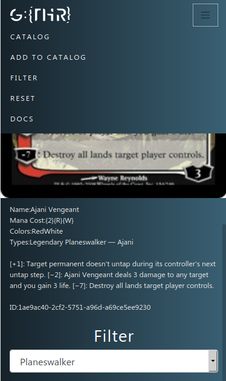

 

 

 <h3 align="center">GTHR: Catalog App bootstraped with React + Redux</h3>

 

  Catalog creator for Magic The Gathering cards using React + Redux
    
 

<!-- TABLE OF CONTENTS -->
## Table of Contents

* [About the Project](#about-the-project)
* [Live Demo](#live-demo)
* [How to run](#how-to-run)
* [Features](#features)
* [Screenshots](#screenshots)
* [Built With](#built-with)
* [Contact](#contact)

## About The Project

This app uses the official Magic the Gathering Card Game API to fetch card details regarding any search by name and text

## Live Demo

* [gthr-app](https://gthr-app.herokuapp.com/)

- Sample Search: Name: Ajani
- Ajani's cards have planeswalker, enchantment and / or creature types

### How to run

- Prerequisites

You can acess the live demo or:

- Fork or clone this repository
- run > npm install
- run > npm start
- access your localhost on your browser

### Features

* User can search card for Name and or Text
* User can filter the catalog result by Type
* User can reset catalog to default state

### Screenshots

## Built With

* CSS3
* JavaScript ES6
* React
* Redux
* mtg-sdk
* Bootstrap

API used
* [MtgAPI](https://docs.magicthegathering.io/)
## Contact

Eduardo Bonilla Github [https://github.com/UsagiB](https://github.com/UsagiB)
Eduardo Bonilla Portfolio [Usagib.github.io](http://usagib.github.io)

## Show your support

Give a ⭐️ if you like this project!
